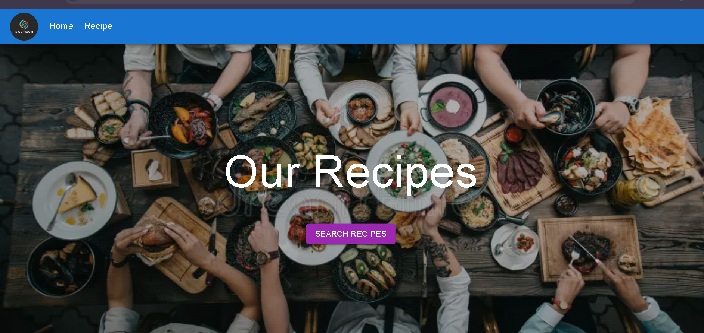

```markdown
# 🍽️ Recipe Application

A fully responsive Recipe Application built with **React (Vite)**, **Material UI**, and **React Router DOM**. Users can search for recipes, view detailed recipe information, and navigate to the original recipe source.

🔗 **Live Demo:** [https://khanfoodapplication.netlify.app/](https://khanfoodapplication.netlify.app/)  
📁 **GitHub Repository:** [https://github.com/PerwezKhan786/recipe-application](https://github.com/PerwezKhan786/recipe-application)

---

## 📸 Screenshot



---

## ✨ Features

- 🔍 Search for recipes by keyword
- 🧾 View detailed information about each recipe
- 🌐 Open original recipe website using the "Recipe URL" button
- 📱 Fully responsive design for mobile and desktop
- ⚡ Built with Vite for fast performance

---

## 🛠️ Tech Stack

- **React (Vite)**
- **Material UI**
- **React Router DOM**
- **Axios** (for API calls)
- **Netlify** (for deployment)

---

## 📂 Project Structure

```

recipe/
├── public/
│   └── screenshot.png
├── src/
│   ├── components/
│   ├── pages/
│   ├── App.jsx
│   └── main.jsx
├── index.html
├── package.json
└── vite.config.js

````

---

## 🚀 Getting Started

### Prerequisites

- Node.js and npm installed
- Git installed

### Clone the Repository

```bash
git clone https://github.com/PerwezKhan786/recipe-application.git
cd recipe-application/recip
````

### Install Dependencies

```bash
npm install
```

### Start Development Server

```bash
npm run dev
```

Your app should now be running at [http://localhost:5173](http://localhost:5173)

---

## 🧪 Build for Production

```bash
npm run build
```

To preview the production build:

```bash
npm run preview
```

---

## 📦 Deployment

This project is deployed on **Netlify**. To deploy it yourself:

1. Push the `recip` folder to GitHub.
2. Connect the repository to Netlify.
3. Set the build command to `npm run build` and the publish directory to `dist`.
4. Click “Deploy”.

---

## 🙌 Author

* **Perwez Khan**
* [GitHub Profile](https://github.com/PerwezKhan786)

---

## 📝 License

This project is licensed under the MIT License.

```

